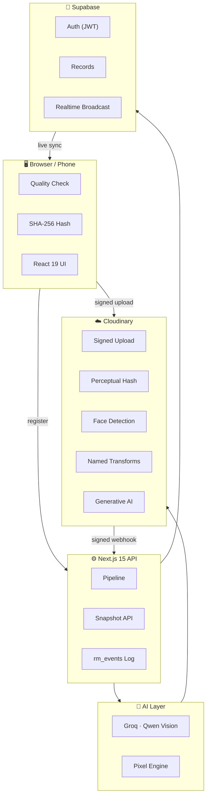
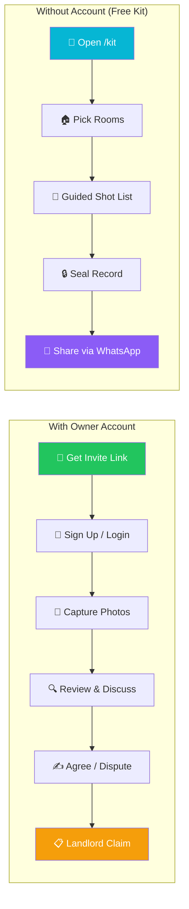
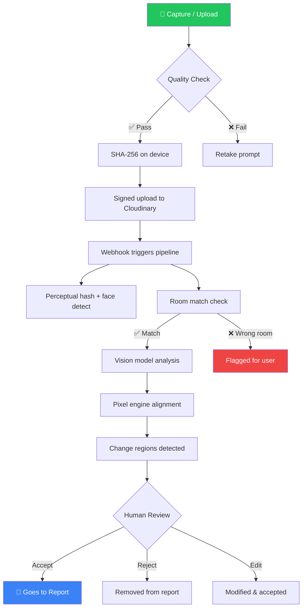
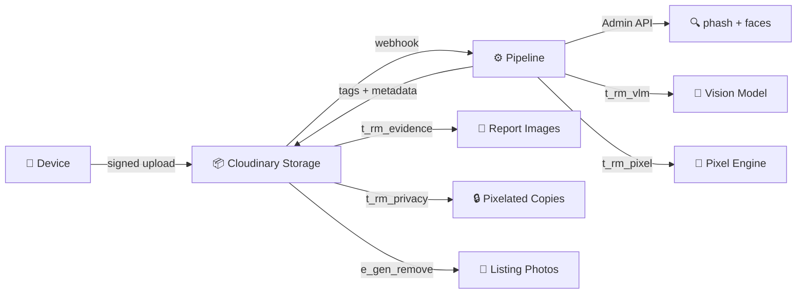

<p align="center">
  
</p>

<p align="center">
  
  
  
  
  
  
  
  
</p>

<p align="center">
  <b>Pixels to Products · Cloudinary AI Hackathon 2026 · Track 3: 🚀 Your Media-Savvy Startup</b>
</p>

<p align="center">
  <a href="https://rental-move.vercel.app"><b>🔗 Live Demo</b></a> &nbsp;·&nbsp;
  <a href="#-quick-start"><b>⚡ Quick Start</b></a> &nbsp;·&nbsp;
  <a href="#-features"><b>✨ Features</b></a> &nbsp;·&nbsp;
  <a href="#-architecture"><b>🏗 Architecture</b></a>
</p>

---

## 💡 The Problem

> Deposit disputes are the #1 fight between tenants and landlords — settled on blurry phone photos nobody can compare, prove, or trust.

**RentalMove** turns inspection photos into a **visual property memory**: every room at every visit, aligned and searchable, with changes detected, located, and reviewed by humans — never decided by AI.

---

## 🎯 Try It in 60 Seconds

| # | What to try | How |
|:-:|-------------|-----|
| 🛡️ | **"Your landlord says you broke it"** | Sign in as tenant *Alex Chen* → **Landlord Claim** → paste *"Shower glass is damaged, deducting ₹4,000"* → see move-in vs move-out side by side with verdict |
| 🔍 | **"It was already there"** | Sign in as owner → **Review** → pick the bathroom finding → see it marked *Matches move-in* |
| ✅ | **"You can't fake it"** | Open **`/verify`** (no login) → drop `demo-assets/kitchen-move-out-ORIGINAL.jpg` ✓ → drop the edited version ✗ |

**Demo logins** (one-click on sign-in page):
- 👤 Tenant: `alex.tenant@rentalmove.demo` · `DemoPassword123!`
- 🏠 Owner: `sarah.owner@rentalmove.demo` · `DemoPassword123!`

---

## ✨ Features

### 📸 Capture & Evidence

| Feature | Description |
|---------|-------------|
| **Ghost Overlay Capture** | Live ghost of the move-in photo + alignment guide ("pan left · step back") + optional auto-shutter |
| **Phone Handoff** | QR code on laptop → phone captures with no login (15-min HMAC token) → photo appears on laptop live |
| **SHA-256 Sealing** | Every photo hashed on-device before upload — tamper-proof chain of custody |
| **Film a Room** | 30–45s video walk → auto frame extraction → quality filtering → smart assignment to checklist items |

### 🧠 AI-Powered Analysis

| Feature | Description |
|---------|-------------|
| **Change Detection** | Pixel engine (align → exposure match → region diff) finds *where*; vision model (Groq Qwen) says *what* |
| **Smart Comparison** | Slider, side-by-side, onion skin, and in-browser pixel diff |
| **Growth Tracking** | Measures affected area across visits → *new*, *grew ×3.4*, *about the same* |
| **Room Match** | Catches photos filed under the wrong room via perceptual hash + aligned pixel match |
| **Everyday-Use Context** | Neutral guidance: *"light scuffs are common after 24 months"* (never accuses) |

### 📋 Workflow & Review

| Feature | Description |
|---------|-------------|
| **Keyboard Triage** | `A/R/E` accept/reject/edit, `J/K` navigate — rapid review |
| **Smart Checklist** | Per-room shot list with *why it matters* ("mould starts on bathroom ceilings") |
| **Visit Submission** | All rooms must be complete → sealed with SHA-256 → locked against edits |
| **Repair Loop** | Finding → work order → repair photo → verified by pixel engine |
| **Discussion Threads** | Tenant and owner agree/dispute per finding with threaded comments |

### 🔐 Privacy & Security

| Feature | Description |
|---------|-------------|
| **Face Pixelation** | `e_pixelate_faces` on every shared/report image via Cloudinary |
| **Private Item Hiding** | Letters, bills, screens pixelated — originals stay untouched |
| **Watermarked Sharing** | Recipient name burned into every shared image — leaks trace back |
| **Signed URLs** | Strict Transformations mode — edited URLs are refused, not billed |
| **Dual Signatures** | Both parties sign SHA-256 of report contents |

### 🌐 Additional Capabilities

| Feature | Description |
|---------|-------------|
| **Free Move-In Kit** | No account needed — guided shot list → sealed record → shareable via WhatsApp/email |
| **Landlord Claim** | Paste landlord's message → auto-matches against evidence (English + Hinglish) |
| **Hindi Reports** | Full हिन्दी translation with English as authoritative |
| **Voice Notes** | Browser transcription (EN/HI) → Cloudinary-stored audio per finding |
| **Re-let Studio** | Evidence photos → listing photos via Cloudinary generative AI (watermarked *AI-ALTERED*) |
| **Public Verify** | Drop any photo → hash checked in-browser against sealed records |
| **Size Estimation** | Drag a reference line → findings show approximate length & area in cm |

---

## 🏗 Architecture



### Tech Stack

| Layer | Technology | Purpose |
|-------|-----------|---------|
| **Frontend** | Next.js 15, React 19, Tailwind CSS | App Router SSR, responsive UI |
| **Media Pipeline** | Cloudinary | Upload, transform, deliver, sign, fingerprint |
| **Vision AI** | Groq (Qwen 3.8-27B) | Scene understanding, change description |
| **Pixel Engine** | Sharp + custom TypeScript | Alignment, exposure matching, region detection |
| **Database** | Supabase (PostgreSQL) | Auth, records, event log, realtime |
| **Validation** | Zod | Runtime type safety on all API boundaries |
| **Testing** | Vitest, Puppeteer | Unit, integration, e2e, evaluation scripts |

---

## 🔄 User Flow

### Owner Journey


### Tenant Journey



### Photo Processing Pipeline



---

## ☁️ Cloudinary as the Media Backbone (Track 3)

> Media is genuinely central to the product — uploads, AI, search, tagging, transforms, generation, optimization & delivery all flow through Cloudinary.



| Capability | Usage |
|-----------|-------|
| **Signed Direct Uploads** | Browser → Cloudinary, API secret never leaves server |
| **Webhook Processing** | Signature-verified notifications, idempotent registration |
| **Perceptual Hash** | Detects re-used photos, cross-verified with pixel alignment |
| **Named Transforms** (`t_rm_*`) | Evidence renditions, privacy, matching — all Strict-Transform safe |
| **Signed URLs** | Dynamic recipes built from whitelist, signed server-side |
| **Privacy Pixelation** | `e_pixelate_faces` + `e_pixelate_region` for private items |
| **Watermarks** | `l_text` with recipient name burned into shared images |
| **Generative AI** | `e_gen_remove`, `e_enhance` for listings only (watermarked *AI-ALTERED*) |
| **Optimized Delivery** | `f_auto`, `q_auto` — 611 KB originals → ~57 KB delivered |

---

## 📊 Measured Results

| Test | Result |
|------|--------|
| **Change Detection** (pixel engine) | 8/9 changes found, mean IoU 0.49, **0 false positives** |
| **Room Match** | Same room: 0.989–0.999 match; wrong room: ≤ 0.21 |
| **Growth Tracking** | 8/9 *new* detected; grout discolouration *grew ×3.37* across visits |
| **Repair Verification** | Repaired → *reduced* 7/7, not repaired → *unchanged* 7/7 |
| **Photo Tampering** | Photoshop-edited → flagged; matching date → ok (3/3) |
| **Hindi Translation** | 35/35 strings valid after mixed-script rejection |
| **Privacy Coverage** | Letter covered 100% (landscape), 87% (portrait) after pixel snapping |
| **Move-In Kit e2e** | 35/35 API checks + 31/31 browser checks |
| **Unit Tests** | 195/197 passing (2 stale text assertions from recent refactor) |
| **Model Abstention** | Dark/blurred → `can_assess: false` with reason; clear → 2 findings |

---

## 🛡️ Guardrails

```
┌─────────────────────────────────────────────────────────────────┐
│  ✓ Describes, never accuses — neutral language only             │
│  ✓ Anti-hallucination filter — drops tiny boxes, duplicates     │
│  ✓ Nothing slips — pixel changes without AI labels → review     │
│  ✓ Humans decide — every finding starts pending                 │
│  ✓ Pre-existing visible — same-spot findings marked             │
│  ✓ Evidence never generated — pixelation only, no gen-fill      │
│  ✓ Verifiable — hashes, signatures, public verification         │
│  ✓ "Not sure" bucket — weak evidence flagged, not presented     │
│  ✓ Model can abstain — "too dark" rather than guess             │
└─────────────────────────────────────────────────────────────────┘
```

---

## ⚡ Quick Start

```bash
# 1. Install
git clone https://github.com/Hemant-gupta2006/RentalMove.git
cd RentalMove
npm install

# 2. Configure
cp .env.example .env
# Fill in: Cloudinary, Groq, Supabase keys

# 3. Database
# Run in Supabase SQL editor:
#   supabase/migrations/0001_init.sql
#   supabase/migrations/0002_auth_integration.sql
#   supabase/migrations/0003_studio_events.sql

# 4. Cloudinary Setup
npx tsx scripts/provision-cloudinary.ts
npx tsx scripts/provision-named-transformations.ts
# Then enable: Settings → Security → Strict Transformations

# 5. Demo Data (optional)
npx tsx scripts/reseed-studio.ts

# 6. Run
npm run dev
```

---

## 🧪 Testing

```bash
npx vitest run                              # Unit + integration tests
node scripts/api-smoke.mjs                  # API smoke tests (both demo users)
node scripts/e2e-smoke.mjs [url] [role]     # Full browser smoke test
npx tsx scripts/e2e-kit.ts [url]            # Move-in kit e2e (self-cleaning)
node scripts/e2e-kit-ui.mjs [url]           # Kit in phone-sized browser
npx tsx scripts/eval-change-detection.ts    # Pixel engine accuracy
npx tsx scripts/eval-measure.ts             # Growth trend + repair verification
```

---

## 📁 Project Structure

```
RentalMove/
├── src/
│   ├── app/
│   │   ├── (studio)/          # Dashboard: overview, capture, review, compare,
│   │   │                      #   report, rooms, timeline, map, memory, search,
│   │   │                      #   relet, lab, repairs, claim, submission
│   │   ├── api/               # REST: snapshot, stream, assets, handoff, media,
│   │   │                      #   uploads, share, verify, kit, report, search
│   │   ├── welcome/           # Landing + guided tour
│   │   ├── login/ & signup/   # Auth pages
│   │   ├── verify/            # Public hash verification
│   │   ├── kit/ & k/          # Move-in kit (no account)
│   │   ├── r/[token]/         # Shared report (read-only)
│   │   └── h/[token]/         # Phone handoff capture
│   ├── lib/                   # Core: pipeline, vision, pixel engine, grounding,
│   │                          #   compare, fingerprint, events, snapshot, recipes,
│   │                          #   cloudinary-urls, media, hash, kit-node, video-frames
│   └── components/            # UI: shell, providers, compare viewer, floor plan,
│                              #   assistant, tour, parties, handoff
├── scripts/                   # Provisioning, re-seed, evaluation, smoke tests,
│                              #   e2e checks, backfill, maintenance
├── seed/                      # Demo photos, staging script, ground truth
├── supabase/migrations/       # Schema (0001–0003)
└── data/                      # Local fallback for events + backups
```

---

## 🔑 Environment Variables

| Variable | Required | Service |
|----------|:--------:|---------|
| `CLOUDINARY_CLOUD_NAME` | ✅ | Cloudinary |
| `CLOUDINARY_API_KEY` | ✅ | Cloudinary |
| `CLOUDINARY_API_SECRET` | ✅ | Cloudinary |
| `CLOUDINARY_NOTIFICATION_URL` | ⬜ | Webhook (needs public HTTPS) |
| `NEXT_PUBLIC_SUPABASE_URL` | ✅ | Supabase |
| `NEXT_PUBLIC_SUPABASE_ANON_KEY` | ✅ | Supabase |
| `SUPABASE_SERVICE_ROLE_KEY` | ✅ | Supabase |
| `GROQ_API_KEY` | ✅ | Groq AI |
| `UPSTASH_REDIS_REST_URL` | ⬜ | Rate limiting (optional) |
| `UPSTASH_REDIS_REST_TOKEN` | ⬜ | Rate limiting (optional) |

---

## ⚠️ Honest Limits

<details>
<summary><b>Click to expand — what we tell you upfront</b></summary>

- **Timestamps** use server clock + EXIF — not an independent third-party source
- **RentalMove proves this account controls this record**, not that this person owns the building
- **Alignment** handles shift and zoom; rotation and perspective are out of scope
- **Sizes are approximate** — one reference line, no perspective correction
- **Growth needs 3+ visits** — first follow-up only shows *new since move-in*
- **Groq quota** — free tier is 200K tokens/day; failures are surfaced, never fabricated
- **Hindi** is machine translation — a native speaker should review before relying on it
- **Voice transcription** uses browser speech service (Chrome sends audio to Google)
- **"Not sure" thresholds** were tuned on 15 staged findings
- **Private item detection** without Cloudinary OCR add-on relies on the vision model, which can miss small items
- **Move-in kit** links are bearer secrets — there is no account, the link holder controls the kit

</details>

---

<p align="center">
  <sub>Built for the <b>Cloudinary AI Hackathon 2026</b> · Track 3: 🚀 Your Media-Savvy Startup</sub>
</p>
